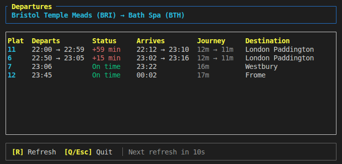

# departures

A terminal UI for viewing live UK train services using the National Rail Darwin OpenLDBWS API.



## Features

- Live departures between two stations
- Shows scheduled/expected times, delays, and platform information
- Filters by Train Operating Company (TOC)
- Auto-refreshes at configurable intervals
- Colour-coded status indicators (on time, late, cancelled)

## Requirements

- Rust
- A National Rail OpenLDBWS API token

## Getting an API Token

1. Register at [National Rail Enquiries](http://realtime.nationalrail.co.uk/OpenLDBWSRegistration/)

## Installation

```bash
cargo build --release
```

## Usage

Set your API token as an environment variable:

```bash
export NRE_LDBWS_TOKEN="your-token-here"
```

Run the application:

```bash
cargo run -- --from IPS --to LST
departures --from PAD --to RDG
```

### Options

| Option | Description | Default |
|--------|-------------|---------|
| `--from` | Origin station CRS code (e.g. PAD) | Required |
| `--to` | Destination station CRS code (e.g. RDG) | Required |
| `--toc` | Train Operating Company code | GW |
| `--rows` | Number of services to display | 10 |
| `--window-mins` | Time window in minutes () | 120 |
| `--offset-mins` | Offset from current time in minutes (there is a limit to how far into the future you can go here) | 0 |
| `--refresh` | Refresh interval in seconds | 30 |

### Example

Show Great Western Railway departures from London Paddington to Reading:

```bash
departures --from PAD --to RDG --toc GW
```

### Controls

- `q` or `Esc` - Quit
- `r` - Force refresh

## Station Codes

Station codes are 3-letter CRS (Computer Reservation System) codes. You can find them at [National Rail](https://www.nationalrail.co.uk/stations_destinations/default.aspx).

For example:
- PAD - London Paddington
- RDG - Reading
- BRI - Bristol Temple Meads
- EUS - London Euston
- KGX - London King's Cross
